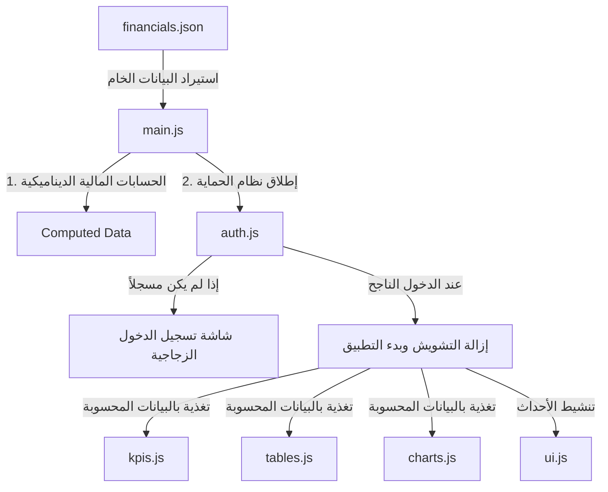

# دليل التحول المعماري والمهاجرة لـ مشروع تقرير محلات العائلة
# Project Architectural Transformation & Migration Guide

أهلاً بك يا زميلي الذكاء الاصطناعي (أو المطور الفاضل)! إذا كنت تقرأ هذا الملف، فقد تم تكليفك بمتابعة صيانة أو تطوير أو تحليل هذا المشروع. تم إعداد هذا الملف خصيصاً ليوضح لك وبأعلى درجات الدقة الهندسية كيف تم تحويل لوحة التحكم المالية لـ **"محلات العائلة"** من ملف واحد متكدس إلى مشروع ويب متكامل وحديث ومحمي.

---

## 1. الخلفية والهدف (Background & Objective)
في البداية، كان المشروع عبارة عن صفحة واحدة (`index.html`) تتكون من **558 سطراً**، وتجمع في طياتها:
* هيكل الصفحة (HTML)
* تصميم الواجهات وتنسيقات الألوان (CSS)
* الأرقام المالية الخام الممثلة لـ 14 شهراً (Hardcoded JSON Data)
* الرسوم البيانية والجداول البرمجية ومنطق التنقل بين التبويبات (Logic)

**المشكلات التي تم حلها بهذا التحول:**
1. **صعوبة التطوير والتوسع:** خلط البيانات بالكود جعل من الصعب جداً إضافة أشهر جديدة أو إضافة صفحات مستقلة.
2. **انعدام الحماية:** التقارير المالية حساسة وتحتوي على أرقام داخلية للمحلات، ولم يكن هناك أي حماية تمنع الدخول العشوائي للموقع المنشور على GitHub Pages.
3. **مشكلات المسارات على GitHub Pages:** عند استعمال لوحات عمل معقدة، قد تضيع مسارات الصور أو الأكواد إذا لم يتم ضبط الـ Base Path برمجياً.

---

## 2. الهيكل المعماري الجديد (Target Architecture)
تم استخدام **Vite** كأداة بناء وتطوير حديثة وسريعة تعتمد على **نظام الوحدات البرمجية (ES Modules)**. يتوزع المشروع الآن كالتالي:

```text
taqrir-ribhiya/
│
├── index.html                  # ملف الـ HTML الرئيسي للمشروع (خالٍ تماماً من الأكواد المكدسة)
├── package.json                # إدارة الحزم والاعتمادات (Vite, Chart.js, gh-pages)
├── vite.config.js              # ملف إعدادات Vite وضبط المسار الأساسي لـ GitHub Pages
├── MIGRATION.md                # [هذا الملف] مستند شرح التحول وتوجيه المطورين والذكاء الاصطناعي
│
├── css/
│   └── styles.css              # التنسيقات والستايلات الكاملة للموقع وشاشة الدخول وتجاوب الشاشات
│
└── src/
    ├── main.js                 # نقطة الدخول والتحكم، يقوم بالحسابات الرياضية ويربط المكونات ببعضها
    │
    ├── data/
    │   └── financials.json     # المصدر الوحيد والمنظم للبيانات المالية الخام لجميع الأشهر
    │
    └── js/
        ├── auth.js             # نظام الحماية محلياً (التحقق وتأمين حالة الدخول باستخدام localStorage)
        ├── charts.js           # رسم وتحديث الرسوم البيانية العشرة بالكامل متوافقة مع ESM
        ├── tables.js           # بناء الجداول وتنسيقها شرطياً بالكامل ديناميكياً
        ├── kpis.js             # حساب وعرض أشرطة الـ KPIs في تبويبي الأرباح والكاش فلو
        └── ui.js               # إدارة التفاعلات مثل التبويبات وزر قفل لوحة البيانات
```

---

## 3. سلسلة جريان البيانات (Data Flow & Computation)
عند تحميل التطبيق، تجري البيانات بالترتيب الهندسي التالي:



### العمليات الحسابية التي تتم برمجياً في `main.js`:
* **الفائدة (الهامش التقديري):** يتم حساب الفائدة تلقائياً لكل شهر بضرب قيمة الإيراد في `0.15` (15%).
* **المصاريف التشغيلية الفعلية (Opex Actual):** مجموع (رواتب + إيجار فعلي + مرافق + رسوم بنكية + نقل + تراخيص + مصاريف أخرى).
* **المصاريف التشغيلية الموزعة (Opex Spread):** مجموع المصاريف مع استبدال الإيجار الفعلي بالإيجار الموزع ربعياً.
* **صافي الربح والخسارة ونسبه المئوية** لكلا الحالتين (الفعلي والموزع).
* **الكاش فلو:** الفائض النقدي بعد سداد الموردين ومصاريف التشغيل ومصاريف العائلة.
* **فجوة الموردين:** الفرق بين مدفوعات الموردين الفعلية ومشتريات البضائع لنفس الشهر.

---

## 4. نظام الحماية والأمان (Authentication & Security)
بما أن الصفحة ترفع ساكنة على GitHub Pages، تم تنفيذ نظام حماية محلي متطور من الناحية البصرية والبرمجية:
* **كلمة المرور الافتراضية:** `Family@2026`
* **آلية العمل:**
  1. عند فتح الصفحة، يتحقق ملف `auth.js` من وجود توكن الدخول المعتمد في `localStorage` باسم `taqrir_family_auth_state`.
  2. في حال عدم وجوده، يتم تفعيل شاشة الدخول ذات تصميم **Glassmorphism (تأثير الزجاج البلوري المطفي)** والتي تحجب لوحة البيانات بالكامل تحتها وتطبق فلاتر التشويش البصري `.app-blurred` على محتوى التقارير.
  3. عند كتابة الرقم السري بشكل صحيح، يتم حفظ توكن النجاح وإجراء حركة انتقالية ناعمة (Transition) تخفي القفل وتظهر البيانات وتفعل الرسوم البيانية.
  4. تمت إضافة زر **`🔒 قفل التقرير`** في أعلى اليسار بشكل ذكي ليتمكن المستخدم من تسجيل خروجه يدوياً وإعادة إغلاق التقرير فوراً.

---

## 5. ضبط إعدادات النشر على GitHub Pages
يعتبر هذا المشروع منشوراً على رابط مخصص يتضمن مساراً فرعياً: `https://fo0ouad.github.io/taqrir-ribhiya/`.
لذا تم اتخاذ خطوة هامة جداً في ملف `vite.config.js`:
```javascript
export default defineConfig({
  base: '/taqrir-ribhiya/', // لكي تبدأ جميع مسارات الأكواد والستايلات من المجلد الفرعي للمستودع
});
```
هذا يضمن أن جميع ملفات الـ Assets يتم تحميلها بنجاح دون إظهار أخطاء `404 Not Found` الشهيرة على GitHub Pages.

---

## 6. دليل التطوير والتحديث للمستقبل (Developer Maintenance Guide)

### أ) كيف تضيف شهراً جديداً أو تعدل رقماً مالياً؟
**هذه هي الميزة الأقوى في الهيكلة الجديدة!** لا تحتاج للمس أي كود برمجي.
1. افتح الملف: [financials.json](file:///Users/fuad_m/Documents/GitHub/taqrir-ribhiya/src/data/financials.json)
2. ستجد مصفوفات مرتبطة ببعضها بحسب الترتيب الزمني للأشهر (من يناير 25 إلى فبراير 26).
3. لإضافة شهر جديد (مثال: مارس 26)، توجه لنهاية كل مصفوفة وأضف القيمة الخاصة بالشهر الجديد.
   * *مثال:* أضف `"مارس 26"` في مصفوفة `months`، وأضف إيراده في مصفوفة `revenue` وهكذا في بقية المصفوفات الـ 13.
4. بمجرد الحفظ، سيتكفل التطبيق بقراءة القيم الجديدة، وإعادة رسم الرسوم البيانية العشرة تلقائياً وتحديث أرقام الجداول والمؤشرات بدون أي تدخل برمي إضافي!

### ب) كيف تضيف صفحة أو تبويباً جديداً؟
إذا طلب منك المستخدم إضافة صفحة جديدة (مثال: تبويب لتحليل أداء خياطين معينين أو مبيعات بضاعة محددة):
1. افتح ملف `index.html` وتوجه إلى جزء `<div class="nav-tabs">` وأضف تبويباً جديداً يحمل `data-tab="custom_name"`.
2. في نفس الملف، قم بإنشاء حاوية جديدة تحمل معرفاً مساوياً: `<div id="tab-custom_name" class="tab-content">`.
3. اكتب كود الرسم والتنسيق الخاص بصفحتك داخل هذه الحاوية.
4. قم ببرمجة المكون المالي الجديد في ملف مستقل تحت `src/js/` (مثال: `src/js/tailors.js`) واستدعه في `src/main.js` لعرض البيانات بداخل التبويب الجديد.

---

## 7. أوامر التشغيل والنشر (Commands Guide)

لتشغيل وتطوير المشروع، استخدم الأوامر القياسية التالية من مجلد المشروع الرئيسي:

```bash
# 1. تثبيت الاعتمادات والمكتبات لأول مرة
npm install

# 2. تشغيل خادم التطوير المحلي مع التحديث التلقائي الفوري (HMR)
npm run dev

# 3. بناء النسخة الإنتاجية المضغوطة والخالية من الأخطاء
npm run build

# 4. النشر التلقائي والمباشر لفرع gh-pages على GitHub لتحديث الموقع على الويب فوراً بضغطة زر واحدة!
npm run deploy
```

> **ملاحظة:** أمر `npm run deploy` يقوم تلقائياً ببناء الكود أولاً (build) ثم رفع مجلد الـ `dist` لفرع النشر المخصص على حسابك في GitHub، مما يحدّث رابط الويب الفعلي مباشرة وبدون أي عناء!

---
إن هذا التصميم البرمجي يوفر أقصى درجات المرونة والجمالية البصرية العالية، ويجعل صيانته بواسطة أي مطور أو ذكاء اصطناعي في المستقبل مهمة غاية في السهولة والتنظيم!
